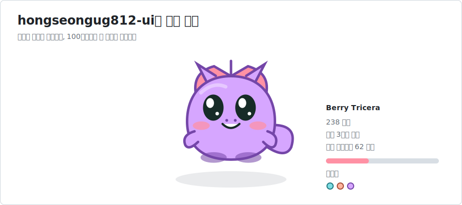
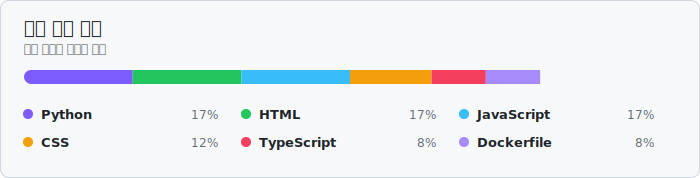

 

 

<b>CS major · Cloud minor | Building things with AI</b>

Public repositories analyzed automatically · A new dinosaur every 100 commits · Refreshed every hour

<a href="https://github.com/hongseongug812-ui?tab=repositories">Repositories</a>

 

## Information

<table>
  
  <tr><td><b>Interests</b></td><td>Full-stack · Backend · AI / LLM · Python · JavaScript · Java</td></tr>
  
</table>

<table>
  <tr>
    
    <td width="50%" valign="top">
      <h3>What I bring</h3>
      <ul><li>Hands-on experience across 21 public repositories</li><li>Product development with Python, JavaScript, Java</li></ul>
    </td>
    
    
    <td width="50%" valign="top">
      <h3>Currently focused on</h3>
      <ul><li>Building Full-stack projects</li><li>Building Backend projects</li></ul>
    </td>
    
  </tr>
</table>

 

## Dev Stacks

<table>
  <tr><td><b>AI & Cloud</b></td><td><code>OpenAI</code> &nbsp;<code>LLM</code> &nbsp;<code>PyTorch</code> &nbsp;<code>Gemma</code> &nbsp;<code>AWS</code></td></tr>
  <tr><td><b>Back-end</b></td><td><code>FastAPI</code> &nbsp;<code>Spring Boot</code> &nbsp;<code>Python</code> &nbsp;<code>Java</code> &nbsp;<code>Kotlin</code> &nbsp;<code>Node.js</code></td></tr>
  <tr><td><b>Front-end</b></td><td><code>React</code> &nbsp;<code>Next.js</code> &nbsp;<code>TypeScript</code> &nbsp;<code>JavaScript</code></td></tr>
  <tr><td><b>Database</b></td><td><code>Supabase</code> &nbsp;<code>PostgreSQL</code> &nbsp;<code>MySQL</code> &nbsp;<code>Redis</code> &nbsp;<code>SQL</code></td></tr>
  
</table>

 

## Featured Repositories

<table>

  <tr>
  
    <td width="50%" valign="top">
      <h3><a href="https://github.com/hongseongug812-ui/mc-devkit">mc-devkit</a></h3>
      
MC DevKit is a web-based server management tool that allows easy opening and managing of Minecraft servers without port forwarding, supporting external access, team management, real-time monitoring, and automatic performance optimization.

      
<b>JavaScript</b> · ★ 0 · Forks 0 · Updated 2026-07-12

    </td>
  
    <td width="50%" valign="top">
      <h3><a href="https://github.com/hongseongug812-ui/hongseongug812-ui">hongseongug812-ui</a></h3>
      
Auto Profile Curator is a GitHub repository that automatically analyzes and curates the README of public repositories, extracting key information such as role, technology stack, projects, and recent activity to generate an optimized profile for its owner.

      
<b>Python</b> · ★ 0 · Forks 0 · Updated 2026-07-14

    </td>
  
  
  </tr>

  <tr>
  
    <td width="50%" valign="top">
      <h3><a href="https://github.com/hongseongug812-ui/llm-bench-dashboard">llm-bench-dashboard</a></h3>
      
This GitHub repository provides a CLI tool for benchmarking local LLMs, comparing results across Mac and Windows devices in a dashboard format, and automatically generating PDF reports based on predefined acceptance criteria.

      
<b>Python</b> · ★ 0 · Forks 0 · Updated 2026-07-14

    </td>
  
    <td width="50%" valign="top">
      <h3><a href="https://github.com/hongseongug812-ui/grounded_work_ai">grounded_work_ai</a></h3>
      
Grounded Work AI is an AI business assistant platform that uses grounded artificial intelligence to generate answers, drafts, and execute actions based on uploaded documents. It includes features for document-based Q&A, automatic email/Jira ticket/Slack message drafting, and action approval with real-time monitoring.

      
<b>Python</b> · ★ 0 · Forks 0 · Updated 2026-03-08

    </td>
  
  
  </tr>

  <tr>
  
    <td width="50%" valign="top">
      <h3><a href="https://github.com/hongseongug812-ui/safewave">safewave</a></h3>
      
SafeWave is a real-time AI platform that detects falls, unauthorized entries, and prolonged inactivity using WiFi Channel State Information (CSI), without the need for cameras or wearable devices, and notifies caregivers via WebSocket.

      
<b>JavaScript</b> · ★ 0 · Forks 0 · Updated 2026-04-04

    </td>
  
    <td width="50%" valign="top">
      <h3><a href="https://github.com/hongseongug812-ui/pixel-project-hq">pixel-project-hq</a></h3>
      
Pixel HQ is a TypeScript React application that provides an AI company's project management dashboard, allowing users to manage projects from a top-down view and interact with multiple AI agents for various tasks.

      
<b>TypeScript</b> · ★ 0 · Forks 0 · Updated 2026-03-21

    </td>
  
  
  </tr>

</table>

 

## Languages

  

 

## Activities

### 2026

- **hongseongug812-ui** 2026 — Python project

- **llm-bench-dashboard** 2026 — Python project

- **mc-devkit** 2026 — JavaScript project

- **backend** 2026 — backend part

### 2025

- **TFT_Game** 2025 — Unity ShaderLab 기반 TFT 스타일 전략 게임 프로젝트

- **voxy** 2025 — 실시간 음성 번역 

---

Curated automatically from public repositories · Refreshed hourly

