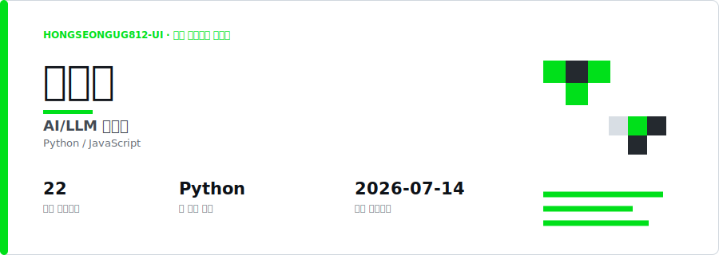
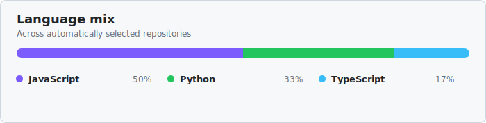

<div align="center">

# Auto Profile Curator

### GitHub 사용자명 하나로 완성하는 자동 프로필 README

공개 저장소를 분석해 나를 가장 잘 보여주는 역할, 기술 스택, 프로젝트와 활동을 정리합니다.  
한 번 설정하면 매시간 새 커밋을 확인하고 프로필을 자동으로 갱신합니다.

<br>



<br>

**사용자명 입력 · 저장소 자동 분석 · 로컬 LLM 요약 · 매시간 자동 갱신**

</div>

---

## 무엇을 해주나요?

Auto Profile Curator는 GitHub 공개 저장소를 읽고 프로필 README에 필요한 내용을 자동으로 구성합니다.

- GitHub 표시 이름을 가져오고 사용자가 입력한 이름이 있으면 우선 적용합니다.
- 전체 저장소를 분석해 `AI / LLM Developer`, `Backend Developer` 같은 주 역할을 추론합니다.
- 언어와 저장소 설명에서 프레임워크, 데이터베이스, AI·클라우드 기술을 찾습니다.
- 포크와 보관된 저장소를 제외하고 대표 프로젝트를 자동으로 선정합니다.
- 최근 커밋 연도를 기준으로 활동 내역을 구성합니다.
- Ollama 로컬 모델로 README를 요약하며 외부 AI API 키가 없어도 동작합니다.
- GitHub Actions가 매시간 변경을 확인하고 달라진 내용이 있을 때만 커밋합니다.

<br>

## 생성 결과

<table>
  <tr>
    <td width="50%" valign="top">
      <h3>자동 프로필 분석</h3>
      <p>이름, 역할, 관심 분야, 강점과 현재 집중 분야를 공개 저장소에서 추론합니다.</p>
    </td>
    <td width="50%" valign="top">
      <h3>대표 프로젝트 큐레이션</h3>
      <p>별, 포크, README, 최근 커밋과 언어 다양성을 점수화해 보여줄 프로젝트를 고릅니다.</p>
    </td>
  </tr>
  <tr>
    <td width="50%" valign="top">
      <h3>기술 스택 정리</h3>
      <p>AI·Cloud, Back-end, Front-end, Database 영역으로 기술을 자동 분류합니다.</p>
    </td>
    <td width="50%" valign="top">
      <h3>지속적인 자동 갱신</h3>
      <p>매시간 저장소 활동을 확인하고 프로필 내용이 바뀐 경우에만 업데이트합니다.</p>
    </td>
  </tr>
</table>

<div align="center">
  
</div>

<br>

## 빠르게 시작하기

1. 이 저장소에서 **Use this template**을 누릅니다.
2. 새 공개 저장소 이름을 자신의 GitHub 사용자명과 정확히 같게 만듭니다.
3. `config.yml`의 `profile.github_username`에 사용자명을 입력합니다.
4. 저장소의 **Actions → Update profile README → Run workflow**를 실행합니다.
5. 작업이 끝나면 생성된 README가 GitHub 프로필에 표시됩니다.

```yaml
profile:
  github_username: "your-github-username"
```

이 값 하나만 입력해도 이름, 역할, 관심 분야, 기술 스택, 대표 저장소와 활동이 자동으로 구성됩니다. 직접 지정하고 싶은 항목만 `config.yml`에 추가하면 자동 분석 결과보다 우선 적용됩니다.

> `GITHUB_TOKEN`은 GitHub Actions가 자동으로 제공합니다. 토큰이나 비밀번호를 README 또는 설정 파일에 직접 적지 마세요.

<br>

## 동작 방식

```text
GitHub 사용자명
       ↓
공개 프로필과 저장소 수집
       ↓
역할 · 기술 · 활동 분석
       ↓
대표 프로젝트 점수화
       ↓
Ollama 프로젝트 요약
       ↓
README · Header · Language SVG 생성
       ↓
변경된 경우에만 자동 커밋
```

프로젝트 점수는 별, 포크, README 유무, 최근 커밋, 사용 언어 다양성을 함께 반영합니다. 포크했거나 보관된 저장소는 대표 프로젝트에서 제외됩니다.

<br>

## 직접 꾸미기

자동 분석 결과를 바꾸고 싶다면 `config.yml`에 원하는 값을 입력하세요. 빈 값은 GitHub 정보와 저장소 분석 결과로 자동 채워집니다.

```yaml
profile:
  name: "표시할 이름"
  headline: "직접 지정할 역할"
  introduction: "짧은 자기소개"
  affiliation: "학교 또는 소속"
  certifications: ["자격증"]

stacks:
  ai_cloud: ["OpenAI", "AWS"]
  back_end: ["Python", "FastAPI"]
  front_end: ["React", "TypeScript"]
  database: ["PostgreSQL", "Redis"]
```

더 자세한 설정은 [설치 및 설정 가이드](docs/SETUP.md)에서 확인할 수 있습니다.

<br>

## 로컬에서 실행하기

Python 3.12 이상이 필요합니다. 공개 저장소만 간단히 분석할 때는 토큰 없이도 실행할 수 있습니다.

```bash
python3 -m venv .venv
source .venv/bin/activate
pip install -r requirements.txt

python scripts/fetch_repos.py --username your-github-username --output .cache/repos.json
python scripts/score_projects.py --input .cache/repos.json --output .cache/curated.json
python scripts/render_header.py --config config.yml --input .cache/curated.json --output preview/assets/header.svg
python scripts/render_svg.py --input .cache/curated.json --output preview/assets/languages.svg
python scripts/render_readme.py --input .cache/curated.json --output preview/README.md
```

정밀한 GraphQL 수집을 사용하려면 환경 변수에 GitHub 토큰을 설정할 수 있습니다.

```bash
export GITHUB_TOKEN=github_pat_xxx
```

<br>

## 로컬 대시보드로 실행하기

스크립트를 하나씩 실행하는 대신, 브라우저에서 `config.yml`을 수정하고 파이프라인을 바로 실행할 수 있습니다.

```bash
python scripts/dashboard.py
```

`http://127.0.0.1:8787`가 자동으로 열리며, 값을 입력하고 **저장하고 파이프라인 실행**을 누르면 `config.yml`이 갱신되고 fetch → score → render 전체 단계가 순서대로 실행됩니다. 결과 헤더·언어 SVG와 README는 같은 페이지에서 바로 미리볼 수 있습니다.

<br>

## AI 요약

기본 설정은 GitHub Actions 러너에서 Ollama와 `gemma4:e2b`를 실행합니다. 프로젝트 README 요약 내용은 SHA별로 캐시되어 변경되지 않은 저장소를 반복 처리하지 않습니다.

외부 모델을 사용하려면 `llm.provider`를 `cloud`로 변경하고 저장소 Secret에 `ANTHROPIC_API_KEY`를 추가할 수 있습니다. 선택 사항이며 기본 기능에는 필요하지 않습니다.

<br>

## 테스트

```bash
python3 -m unittest discover -s tests -v
```

<div align="center">

---

<sub>GitHub 공개 데이터와 로컬 AI로 만드는, 계속 살아 있는 프로필 README.</sub>

</div>
