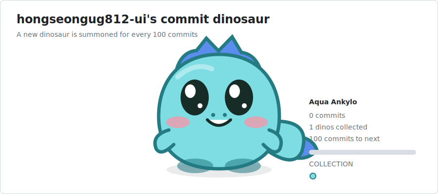

 

 

<b>CS major · Cloud minor | Building things with AI</b>

Public repositories analyzed automatically · A new dinosaur every 100 commits · Refreshed every hour

<a href="https://github.com/hongseongug812-ui?tab=repositories">Repositories</a>

 

## Information

<table>
  
  <tr><td><b>Interests</b></td><td>AI / LLM · Full-stack · Game · Python · JavaScript · Java</td></tr>
  
</table>

<table>
  <tr>
    
    <td width="50%" valign="top">
      <h3>What I bring</h3>
      <ul><li>Hands-on experience across 20 public repositories</li><li>Product development with Python, JavaScript, Java</li></ul>
    </td>
    
    
    <td width="50%" valign="top">
      <h3>Currently focused on</h3>
      <ul><li>Building AI / LLM projects</li><li>Building Full-stack projects</li></ul>
    </td>
    
  </tr>
</table>

 

## Dev Stacks

<table>
  <tr><td><b>AI & Cloud</b></td><td><code>OpenAI</code> &nbsp;<code>LLM</code> &nbsp;<code>PyTorch</code> &nbsp;<code>Gemma</code> &nbsp;<code>AWS</code></td></tr>
  <tr><td><b>Back-end</b></td><td><code>FastAPI</code> &nbsp;<code>Python</code> &nbsp;<code>Java</code> &nbsp;<code>Kotlin</code></td></tr>
  <tr><td><b>Front-end</b></td><td><code>React</code> &nbsp;<code>Next.js</code> &nbsp;<code>TypeScript</code> &nbsp;<code>JavaScript</code></td></tr>
  <tr><td><b>Database</b></td><td><code>Supabase</code></td></tr>
  
</table>

 

## Featured Repositories

<table>

  <tr>
  
    <td width="50%" valign="top">
      <h3><a href="https://github.com/hongseongug812-ui/llm-bench-dashboard">llm-bench-dashboard</a></h3>
      
An open-source project maintained here.

      
<b>Python</b> · ★ 0 · Forks 0 · Updated 2026-07-14

    </td>
  
    <td width="50%" valign="top">
      <h3><a href="https://github.com/hongseongug812-ui/mc-devkit">mc-devkit</a></h3>
      
An open-source project maintained here.

      
<b>JavaScript</b> · ★ 0 · Forks 0 · Updated 2026-07-12

    </td>
  
  
  </tr>

  <tr>
  
    <td width="50%" valign="top">
      <h3><a href="https://github.com/hongseongug812-ui/debete-arena">debete-arena</a></h3>
      
멀티 에이전트 LLM이 실시간 SSE 스트리밍으로 토론하고 수렴 판단까지 자동화한 AI 의사결정 플랫폼

      
<b>Python</b> · ★ 0 · Forks 0 · Updated 2026-04-06

    </td>
  
    <td width="50%" valign="top">
      <h3><a href="https://github.com/hongseongug812-ui/chat2infra">chat2infra</a></h3>
      
비싼 클라우드 엔지니어 없이, 채팅 한 줄로 AWS 서버를 자동 구축하고 관리하는 AI 인프라 비서 서비스입니다

      
<b>JavaScript</b> · ★ 0 · Forks 0 · Updated 2026-04-05

    </td>
  
  
  </tr>

  <tr>
  
    <td width="50%" valign="top">
      <h3><a href="https://github.com/hongseongug812-ui/safewave">safewave</a></h3>
      
WiFi CSI 기반 비접촉 AI 안전관리 플랫폼 | FastAPI + PyTorch CNN-GRU 모델로 낙상·침입 등 6가지 행동 분류

      
<b>JavaScript</b> · ★ 0 · Forks 0 · Updated 2026-04-04

    </td>
  
    <td width="50%" valign="top">
      <h3><a href="https://github.com/hongseongug812-ui/pixel-project-hq">pixel-project-hq</a></h3>
      
픽셀 아트 오피스 기반 AI 프로젝트 관리 앱 | React + OpenAI GPT-4o + Supabase Realtime, 6종 AI 에이전트

      
<b>TypeScript</b> · ★ 0 · Forks 0 · Updated 2026-03-21

    </td>
  
  
  </tr>

</table>

 

## Languages

  

 

## Activities

### 2026

- **llm-bench-dashboard** 2026 — Python project

- **mc-devkit** 2026 — JavaScript project

- **backend** 2026 — backend part

- **arkpvptool** 2026 — ARK: Survival Evolved PVP 분석 웹툴 | React + TypeScript

### 2025

- **TFT_Game** 2025 — Unity ShaderLab 기반 TFT 스타일 전략 게임 프로젝트

- **voxy** 2025 — 실시간 음성 번역 

---

Curated automatically from public repositories · Refreshed hourly

